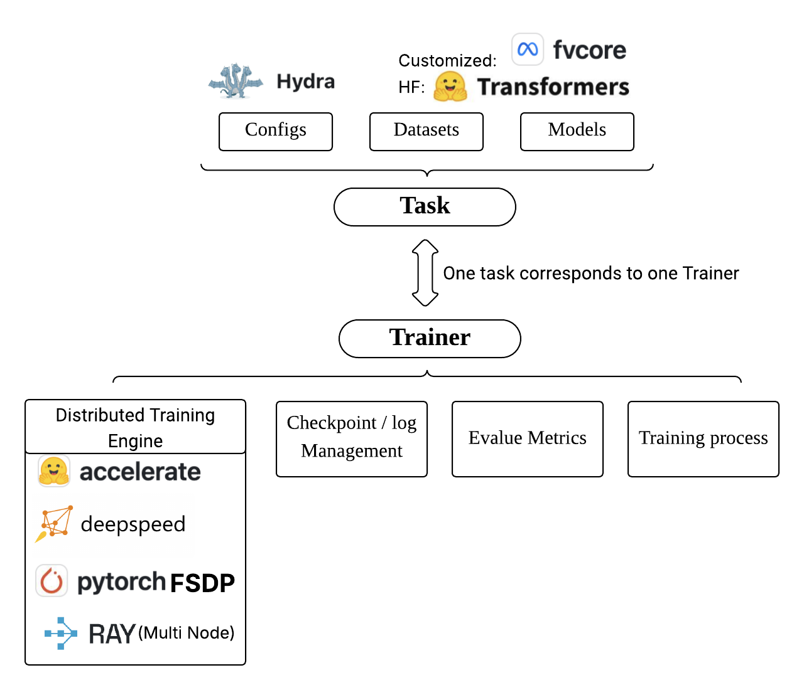

## DLToolkit

A Toolkit for Deep Learning Projects. It provides a set of utilities and modules to streamline the development and deployment of deep learning models.



## Quick Start

Env Setup:
```bash
conda create -n dltoolkit python=3.10 -y
conda activate dltoolkit
pip install -e .
```
Run Example:
```bash
# detailed configs can be found in dltoolkit/trainer/config/img_cls.yaml
python -m dltoolkit.trainer.img_cls model.name_or_path=CovNet_MNIST data.name_or_path=ylecun/mnist trainer.max_epochs=5 
```

You can find output model files and checkpoints in './ckpt' as default.

By default, we use tensorboard as logs tracker(wandb also supported) and you can find training logs in './logs' as default, you can visualize them by:
```bash
tensorboard --logdir=./logs
```

## References & Acknowledgements

Thanks the following wonderful works, this project draws inspirations from them:
- [OpenRLHF](https://github.com/OpenRLHF/OpenRLHF)
- [DeepSpeedChat](https://github.com/deepspeedai/DeepSpeedExamples/tree/master/applications/DeepSpeed-Chat)